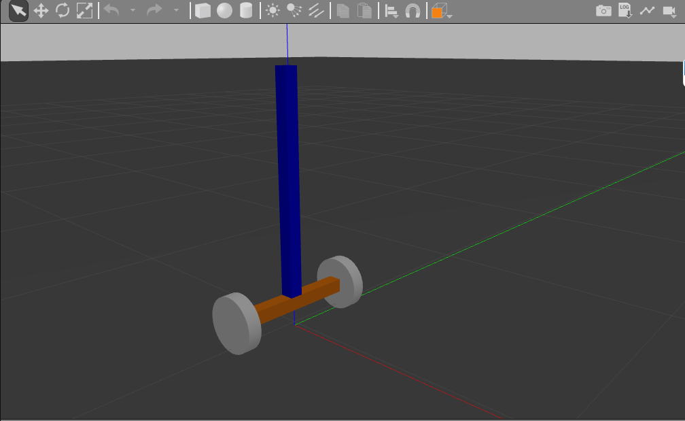
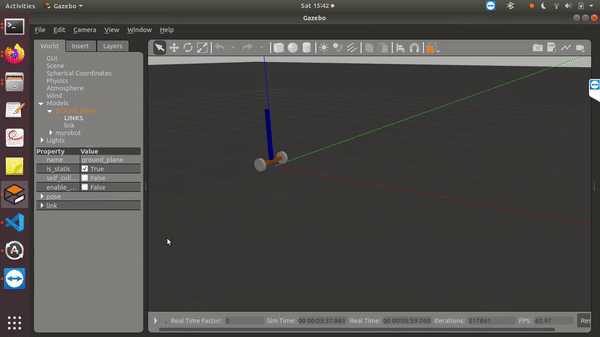

# Wheeled-Inverted-Pendulum-ROS

This project is aimed at analyzing control schemes on a common non linear system, the inverted pendulum.
Here I have created a urdf of a 2 wheeled self balancing pendulum robot. I have created two LQR controllers for the lateral and longitudinal control of the robot. It takes a position value on a command topic and moves to that position. 

**This project is under progress...**   
   
<!---->
   

For questions and suggestions please email me at: jklmpoonawala@gmail.com
